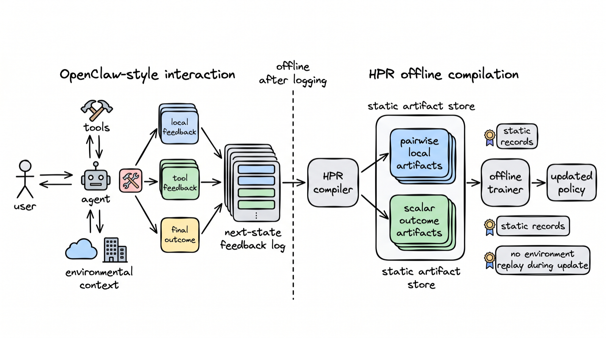

# Offline Hindsight Preference Routing for OpenClaw-Style Agent Learning

This repository is the companion code release for the paper **"Offline Hindsight
Preference Routing for OpenClaw-Style Agent Learning"** (under review).

> **⚠️ Code and related policy content: coming soon.**
> The repository is currently a placeholder. The data-routing code, offline
> artifact schemas, training scripts, and evaluation harness will be released
> here. Please check back later.

---

*Overview of HPR. OpenClaw-style interactions produce next-state feedback logs
during deployment. After logging, HPR compiles the feedback into static offline
artifacts: local feedback becomes pairwise local artifacts, while delayed or
aggregate outcomes become scalar outcome artifacts. The offline trainer updates
the policy from these reusable records without environment replay during the
update.*

---

## Overview

Agent interaction logs contain supervision beyond final rewards: user replies,
tool outputs, state transitions, and test verdicts are all *next-state*
observations that can be used to post-train agents. This work studies the
**offline learning interface** for such signals — given a logged feedback
instance, *what training artifact should it become?*

The key observation is that next-state feedback is **heterogeneous in its
evidence structure**, and the right unit of analysis is the *feedback instance*,
not the task:

- **Local, comparative feedback** (e.g. a user correction) can justify a
  pairwise *chosen / rejected* preference, since the preferred behavior was
  inferable from the pre-feedback context.
- **Outcome-only feedback** (e.g. a delayed task verdict or test failure)
  provides only a scalar *desirable / undesirable* label, without a reliable
  alternative response.
- **Newly revealed or ambiguous feedback** (e.g. a preference the agent could
  not have anticipated) should be logged but *not* used to penalize an earlier
  action.

A single trajectory can contain all three.

## Method: Hindsight Preference Routing (HPR)

HPR is a **typed offline interface** that routes each feedback instance to the
supervision it can validly support:

| Feedback instance | Routed to | Objective |
|---|---|---|
| Context-supported preference / local correction | pairwise HPR artifact | DPO-style |
| Local tool outcome | verifier / rejection / scalar | — |
| Delayed trajectory outcome | scalar outcome artifact | KTO-style |
| Newly revealed preference / neutral context | no update | — |

Because the artifacts are static and offline, they can be inspected, filtered,
mixed across data sources, and reused for retraining **without** preserving
policy-versioned rollouts, old log-probabilities, or objective-specific replay
state.

## Results

Evaluated across three complementary settings:

- **OpenClaw-style personal-agent adaptation** — reaches **0.85** average
  personalization.
- **τ³-bench mixed tool-user trajectories** — improves overall task success to
  **39.3%**.
- **SWE-bench Lite delayed-outcome tasks** — slightly improves over a
  scalar-only baseline on resolved rate (**8.3%** vs. **7.9%**).

These results support feedback-instance routing as a practical offline interface
that learns from agent interactions with lower update-state requirements.

---

## Status

| Component | Status |
|---|---|
| Paper | Under review |
| Routing / training code | Coming soon |
| Offline artifact schemas | Coming soon |
| Evaluation harness | Coming soon |
| Related policy content | Coming soon |

*Content will be populated here as it becomes available.*
