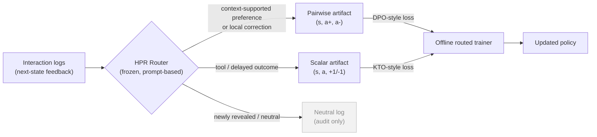

<div align="center">

# Offline Hindsight Preference Routing<br/>for OpenClaw-Style Agent Learning

**Companion code release** &nbsp;·&nbsp; paper under double-blind review


<br/><br/>


<em>Overview of HPR. OpenClaw-style interactions produce next-state feedback logs
during deployment. After logging, HPR compiles the feedback into static offline
artifacts: local feedback becomes pairwise local artifacts, while delayed or
aggregate outcomes become scalar outcome artifacts. The offline trainer updates
the policy from these reusable records without environment replay during the
update.</em>

</div>

---

## Overview

Agent interaction logs contain supervision beyond final rewards: user replies,
tool outputs, state transitions, and test verdicts are all *next-state*
observations that can be used to post-train agents. This work studies the
**offline learning interface** for such signals — given a logged feedback
instance, *what training artifact should it become?*

The key observation is that next-state feedback is **heterogeneous in its
evidence structure**, and the right unit of analysis is the *feedback
instance*, not the task:

- **Local, comparative feedback** (e.g. a user correction) can justify a
  pairwise *chosen / rejected* preference, since the preferred behavior was
  inferable from the pre-feedback context.
- **Outcome-only feedback** (e.g. a delayed task verdict or test failure)
  provides only a scalar *desirable / undesirable* label, without a reliable
  alternative response.
- **Newly revealed or ambiguous feedback** (e.g. a preference the agent could
  not have anticipated) should be logged but *not* used to penalize an earlier
  action.

A single trajectory can contain all three.

## Method

Hindsight Preference Routing (HPR) is a **typed offline interface** that
routes each feedback instance to the supervision it can validly support:



| Feedback instance | Routed to | Objective |
| --- | --- | --- |
| Context-supported preference / local correction | pairwise HPR artifact | DPO-style |
| Local tool outcome | scalar / verifier | KTO-style |
| Delayed trajectory outcome | scalar outcome artifact | KTO-style |
| Newly revealed preference / neutral context | no update | — |

The local branch regenerates an improved response under a training-time
enhanced context `a+ ~ pi(. | s (+) u)` — the hindsight hint `u` is never part
of the deployment prompt. Because all artifacts are static and offline, they
can be inspected, filtered, mixed across data sources, and reused for
retraining **without** policy-versioned rollouts, old log-probabilities, or
objective-specific replay state.

## Quickstart

Run the full pipeline offline — no API key or GPU required (deterministic mock
backend + tiny random model):

```bash
pip install -r requirements.txt
python3 -m tests.test_pipeline
```

With a real OpenAI-compatible endpoint (the paper uses the same-scale Qwen3-4B
backbone for router, interpreter, and regeneration):

```bash
export HPR_API_KEY=...
export HPR_BASE_URL=...   # OpenAI-compatible /v1 endpoint

python3 scripts/route_feedback.py \
  --input feedback_instances.jsonl --output routed.jsonl \
  --provider openai --model qwen3-4b --preserve-structural-labels

python3 scripts/compile_artifacts.py \
  --routed routed.jsonl --output-dir artifacts/ \
  --provider openai --regen-model qwen3-4b

python3 scripts/train_routed.py \
  --model-path Qwen/Qwen3-4B --artifacts-dir artifacts/ \
  --output-dir ckpt/hpr_routed
```

## Repository Layout

```
hpr/            method implementation (router, regeneration, compiler, losses, trainer)
scripts/        CLI entry points for routing, compilation, training, diagnostics
benchmarks/     data splits, evaluation manifests, and experiment pipeline scripts
examples/       toy feedback instances covering all five feedback types
tests/          end-to-end offline smoke test
figures/        overview figure
```

### Method-to-code map

| Paper | Code |
| --- | --- |
| Router `R(x_t)` (Sec. 3.1, App. B) | `hpr/router.py` |
| Hindsight regeneration `a+ ~ pi(. \| s (+) u)` (Sec. 3.3) | `hpr/regenerate.py` |
| Pair construction `D_pair` (Sec. 3.3) | `hpr/compile.py` |
| Scalar loss `-log sigma(alpha y rho)` (Sec. 3.4) | `hpr/losses.py` |
| Pairwise loss `-log sigma(alpha d)` (Sec. 3.5) | `hpr/losses.py` |
| Routed objective `L_route` (Sec. 3.5) | `hpr/train.py` |
| Router diagnostics (Table 3) | `hpr/metrics.py` |
| Artifact schemas (Table 6, Table 7) | `hpr/types.py` |

Only response/action tokens of the routed instance are scored; context tokens
are masked. The reference policy is a frozen copy of the initial policy whose
log-probabilities are precomputed once before training.

## Experiments

`benchmarks/` pins the exact data splits used in the paper (including the
fixed 89-task tau3 evaluation manifest with all task ids listed) and ships the
pipeline scripts for the three evaluation settings. Original benchmark data is
not redistributed; it is rebuilt from the official sources and verified
against the manifests:

```bash
cd benchmarks
git clone https://github.com/sierra-research/tau2-bench vendor/tau2-bench
python3 data/scripts/materialize_tau3_bench.py
python3 data/scripts/materialize_swe_lite.py      # pip install datasets
python3 data/scripts/check_split_integrity.py
```

See `benchmarks/README.md` for the per-setting execution order.

<details>
<summary><b>Default hyperparameters (paper Table 8)</b></summary>

| Parameter | Value |
| --- | --- |
| DPO / KTO beta (`alpha` in the paper) | 0.1 |
| KTO desirable / undesirable weights | 1.0 / 1.0 |
| Learning rate | 1e-5 |
| Training batch size (grad-accum micro-batches) | 16 |
| Max sequence length | 8192 |
| Hint regeneration temperature | 0.7 |
| Hint candidates for rejection sampling | 4 |
| Router confidence threshold | 0.65 |

</details>

<details>
<summary><b>Baseline compilation modes</b></summary>

The single-objective baselines from the paper are recovered by forcing all
non-neutral feedback into one branch:

```bash
python3 scripts/compile_artifacts.py --routed routed.jsonl --output-dir artifacts_scalar/ --force-branch scalar     # Scalar-Only
python3 scripts/compile_artifacts.py --routed routed.jsonl --output-dir artifacts_pair/   --force-branch pairwise   # Pairwise-Only
```

</details>

## Results

HPR is evaluated in three complementary settings that stress different
feedback structures:

- **OpenClaw-style personal-agent adaptation** — routed offline training
  recovers most of the personalization gain of the OpenClawRL-style online
  protocol while training from static artifacts.
- **tau3-bench mixed tool-user trajectories** — feedback-instance routing
  inside single trajectories yields the best overall task success among the
  compared offline and protocol baselines.
- **SWE-bench Lite delayed-outcome tasks** — HPR routes nearly all delayed
  feedback to the scalar branch and remains competitive at the delayed-outcome
  boundary.

Full quantitative results, router diagnostics, and the offline-efficiency
comparison are reported in the paper.

## Citation

The paper is under double-blind review. A BibTeX entry will be added upon
publication.
